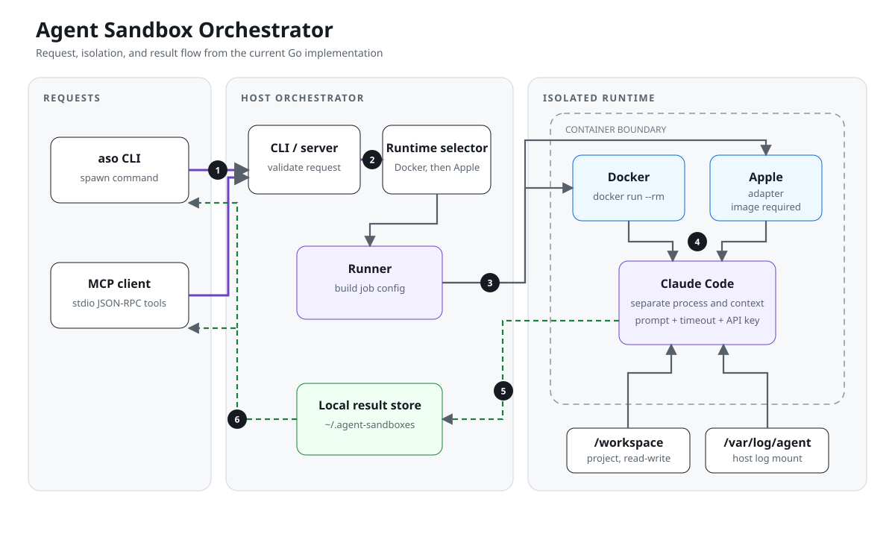

<p align="center">
  
</p>

# Agent Sandbox Orchestrator

[](https://github.com/pkmdev-sec/agents-sandboxing/actions/workflows/ci.yml)
[](go.mod)
[](LICENSE)

Agent Sandbox Orchestrator, or ASO, runs Claude Code jobs in containers. Docker is the current documented setup. The repository also contains an Apple `container` adapter, but the provided build does not load its runtime image into Apple's image store.

## What it does

- Accepts jobs through the `aso` CLI or its stdio MCP server.
- Tries Docker first and then the Apple adapter when selecting a runtime.
- Applies CPU, memory, and timeout settings from the selected agent profile.
- Mounts the project at `/workspace` and job logs at `/var/log/agent`.
- Stores job results under `~/.agent-sandboxes`.

ASO creates a separate Claude context for each process. It does not enforce a token or billing budget.

## Architecture



The CLI and MCP server select a runtime before constructing the shared runner. The runner mounts the workspace and log directory, starts Claude Code, captures the exit state, and writes the result to the local store.

## Requirements

- Go 1.25.6 or the version declared in [`go.mod`](go.mod)
- Docker Desktop for the documented build and run path
- `ANTHROPIC_API_KEY` for the Claude Code process inside the runtime image

## Build and run

```sh
git clone https://github.com/pkmdev-sec/agents-sandboxing.git
cd agents-sandboxing
make build
make runtime-image

export ANTHROPIC_API_KEY=...
./bin/aso spawn --type Explore --prompt "Map the authentication flow" --project .
```

`make runtime-image` builds `ghcr.io/pkmdev-sec/agents-sandboxing-runtime:latest` locally. No prebuilt image is published by this repository.

Select Docker explicitly when needed:

```sh
./bin/aso spawn --runtime docker --type Bash --prompt "Run the tests" --project .
```

The Apple adapter requires the same runtime image to be available to Apple's `container` CLI. This repository does not yet provide a build, import, or publication path for that image.

Resource profiles cover `Explore`, `Plan`, `Bash`, `code-reviewer`, and `general-purpose`. Override a profile per job with `--cpus`, `--memory`, or `--timeout`.

## MCP server

Start the stdio server with:

```sh
./bin/aso mcp serve
```

The server exposes these tools:

| Tool | Purpose |
|---|---|
| `spawn_sandboxed_agent` | Start a job and return a handle |
| `get_agent_status` | Read status tracked by the current MCP server process |
| `list_sandboxed_agents` | List jobs tracked by the server |
| `kill_sandboxed_agent` | Registered but unreliable because the MCP and runner IDs do not yet share one mapping |

[`configs/conductor-mcp.json`](configs/conductor-mcp.json) is an example stdio client configuration for an installed `/usr/local/bin/aso` binary.

## Security boundary

The container narrows host access, but it is not a boundary around the mounted project or forwarded credentials:

- ASO mounts the selected project read-write at `/workspace`.
- ASO forwards `ANTHROPIC_API_KEY` into the container.
- ASO does not mount the host `~/.claude` directory.
- The runtime entrypoint starts Claude Code with `--dangerously-skip-permissions` inside the container.
- Container escape, daemon access, and a compromised runtime image remain outside ASO's guarantees.

Use a dedicated API key and mount only a project that the job may modify.

## Development

```sh
go test ./...
go vet ./...
test -z "$(gofmt -l .)"
```

Build metadata is injected by `make build`. Build the runtime image separately with `make runtime-image`; Go checks do not exercise Docker, Apple containers, provider authentication, or a live Claude request.

MCP state does not survive a server restart. Runtime management, MCP termination, and MCP interoperability remain experimental until their live integration paths have dedicated tests.

## License

[MIT](LICENSE) © pkmdev-sec
